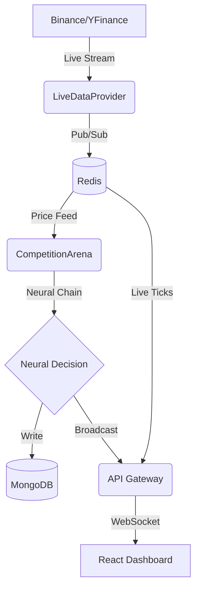

# Maheshwara 2.0: Deep Architectural Analysis

Maheshwara 2.0 is an institutional-grade autonomous trading ecosystem built with a multi-agent "Neural Chain" architecture. It combines real-time data ingestion, high-frequency signal processing, and a cinematic React-based dashboard.

## 1. Backend Architecture: The Central Nervous System

### 1.1 Data Ingestion (`agent_manager/core/live_provider.py`)
- **Sources**: Uses `websockets` for real-time crypto data (Binance Multi-stream) and `yfinance` polling for legacy assets (Stocks/Indices).
- **Pub/Sub Strategy**: Market ticks are published to Redis (`market_ticks`) and cached in keys (`tick:<symbol>`). This ensures low-latency access for both the execution engine and the API Gateway.
- **WebSocket Logic**: Implements a robust reconnection loop for Binance streams, handling miniTickers, klines, and depth-20 order books simultaneously.

### 1.2 The Neural Chain (`agent_manager/core/arena.py`)
The system utilizes a sequential reasoning pipeline (Neural-1 Chain) to reach trading decisions:
1.  **Strategist**: Evaluates macro trends and defines the core bias (Bullish/Bearish/Neutral).
2.  **Tactician**: Identifies precise entry/exit points and sizing based on the bias.
3.  **Sentinel**: The "Guardian" agent. It performs final risk audits, potentially blocking or modifying orders from the Tactician to protect capital.
4.  **Analyst**: Generates a natural language narrative explaining the complex logic behind the decision for the end-user.

### 1.3 Execution & Persistence
- Decisions are saved as `NEURAL_DECISION` documents in **MongoDB**.
- Successful executions are broadcast via the `live_updates` Redis channel.
- Historical time-series data (e.g., price buckets for charts) is managed by **InfluxDB**.

---

## 2. API Layer: The Command Center (`api_gateway/main.py`)

The API Gateway acts as a high-performance relay between the backend intelligence and the user interface.
- **RESTful Endpoints**: Serves portfolio metrics, agent statuses, and historical trade records.
- **WebSocket Hub**: 
    - `/ws/market/{symbol}`: High-frequency price updates.
    - `/ws/trades`: Live execution feed.
    - `/ws/candles`: Real-time chart data sync.
- **Auto-Exit Engine**: A background task monitors `OPEN` paper positions against live Redis prices to trigger target-based exits.

---

## 3. Frontend Architecture: The Cinematic Interface (`dashboard/`)

### 3.1 State Management (`lib/DashboardContext.tsx`)
- **Sliding History**: Maintains a 100-step history of the platform state, allowing for smooth "time travel" analysis and ensuring UI consistency during rapid updates.
- **Hybrid Sync**: Combines polling (for slow data like positions) and WebSockets (for fast data like order flow).

### 3.2 Visual Engine
- **Three.js/Fiber**: Used for high-performance 3D visualizations (e.g., the Neural Arena and risk holograms).
- **Framer Motion**: Powers the fluid, glassmorphic UI transitions.
- **Custom Indicators**: Institutional-grade technical indicators implemented in `lib/indicators.ts`.

---

## 4. Current Operational Bottlenecks
1.  **Model Connectivity**: The Strategist agent occasionally fails to reach the NVIDIA cloud endpoints, leading to "Neutral" fallback bias.
2.  **WebSocket Encoding**: Occasional bytes-vs-string issues in the Binance feed (Fixable via explicit decoding).
3.  **Legacy Document Formats**: Some older trade records in MongoDB lack certain fields (e.g., `winner`), requiring a more robust compatibility layer in the API Gateway.

---

## 5. Summary of Data Flow

